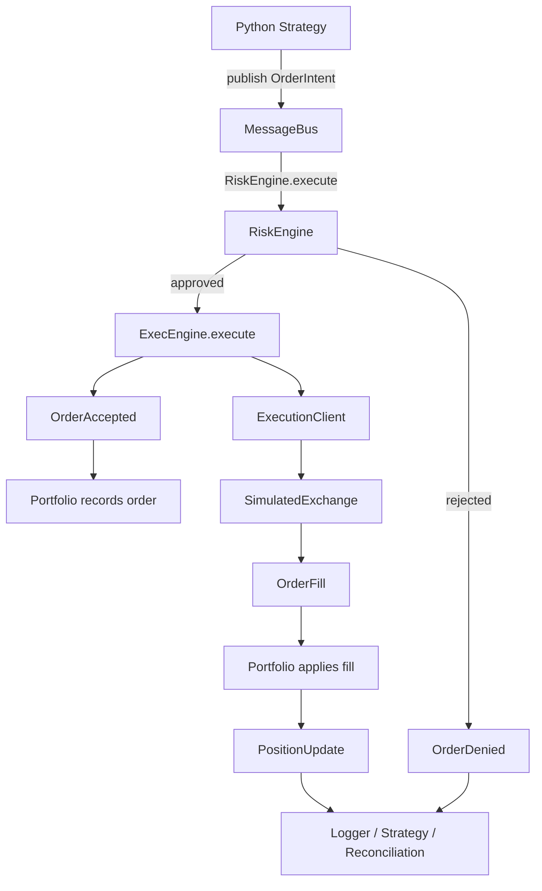
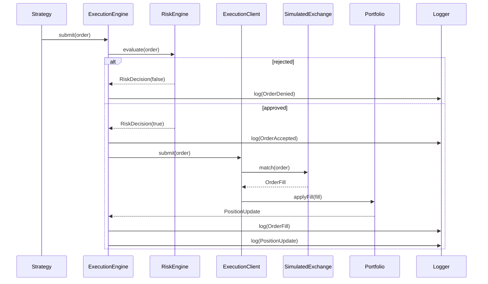
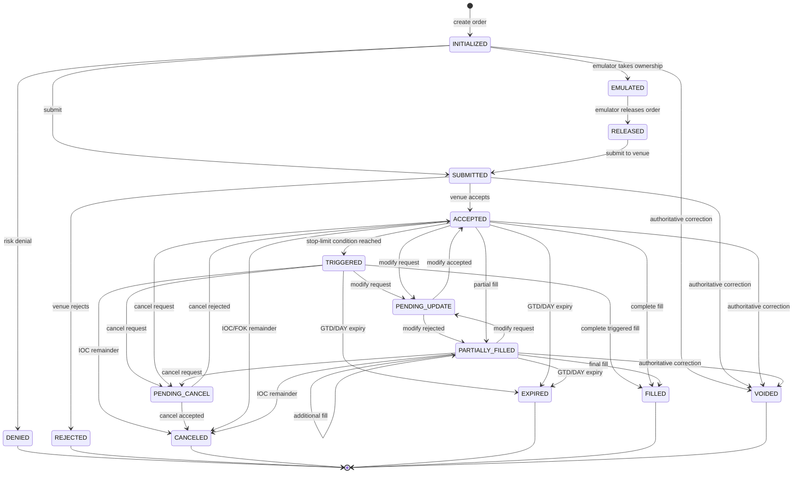

# Nautilus-Style In-Memory Message Bus and Java Design

This document explains the relevant Nautilus Trader Rust message-bus design and maps it to the Java rewrite in `abc-trading`.

The goal is not to copy Nautilus source code. The goal is to preserve the important behavioral properties:

- deterministic event ordering
- synchronous in-memory delivery
- typed event routing
- low allocation on hot paths
- explicit separation between publish/subscribe and point-to-point endpoints
- Python-facing APIs that cross the language boundary as few times as practical

## 1. The Important Answer: Is It a Queue?

Nautilus Trader's core in-memory message bus is **not primarily a queue**.

It is a single-threaded, synchronous dispatcher:

```text
publish(message, topic)
        |
        v
resolve matching subscriptions
        |
        v
call each handler immediately
        |
        v
return to the publisher
```

A published message is normally handled during the call to `publish`. It is not first placed into a queue and consumed later by a separate worker.

Queues or channels exist at asynchronous boundaries, such as external integrations, live listeners, or Redis transport. They are not the core in-memory pub/sub fan-out mechanism.

## 2. Nautilus Rust Data Structures

The main implementation is in:

- `nautilus_trader/crates/common/src/msgbus/core.rs`
- `nautilus_trader/crates/common/src/msgbus/api.rs`
- `nautilus_trader/crates/common/src/msgbus/typed_router.rs`
- `nautilus_trader/crates/common/src/msgbus/typed_endpoints.rs`

### 2.1 General message-bus storage

The Rust `MessageBus` contains structures equivalent to these:

```rust
subscriptions: AHashSet<Subscription>,
topics: IndexMap<MStr<Topic>, Vec<Subscription>>,
endpoints: IndexMap<MStr<Endpoint>, ShareableMessageHandler>,
correlation_index: AHashMap<UUID4, ShareableMessageHandler>,
```

Source: `nautilus_trader/crates/common/src/msgbus/core.rs`

Their responsibilities are different:

| Structure | Purpose |
|---|---|
| `AHashSet<Subscription>` | Track active subscriptions and support identity/removal checks |
| `IndexMap<Topic, Vec<Subscription>>` | Keep topic-associated subscriptions in stable insertion/order-aware storage |
| `IndexMap<Endpoint, Handler>` | Point-to-point endpoint lookup |
| `AHashMap<UUID4, Handler>` | Correlation-based response routing |

The topic map is a routing index. It is not a message queue.

### 2.2 Typed routers

For high-volume typed events, Nautilus uses a `TopicRouter<T>`:

```rust
pub struct TopicRouter<T: 'static> {
    subscriptions: Vec<TypedSubscription<T>>,
    topic_cache: IndexMap<MStr<Topic>, SmallVec<[usize; 64]>>,
}
```

Source: `nautilus_trader/crates/common/src/msgbus/typed_router.rs`

The important detail is that the cache stores **subscription indexes**, not copied messages:

```text
Topic "AAPL.BAR"
        |
        v
[subscription index 0, subscription index 3, subscription index 5]
        |
        v
handlers[0], handlers[3], handlers[5]
```

`SmallVec<[usize; 64]>` is an inline storage optimization for a small number of matching handlers. It is not a ring buffer and not a queue of pending events.

### 2.3 Endpoint map

Point-to-point messaging uses an endpoint map:

```rust
handlers: IndexMap<MStr<Endpoint>, TypedHandler<T>>
```

Sending to an endpoint performs a map lookup and calls the handler directly. This is different from topic publish, where one message may be delivered to several matching subscriptions.

## 3. Nautilus Publish Path

The typed publish path is conceptually:

```rust
pub fn publish(&mut self, topic: Topic, message: &T) {
    let indices = topic_cache.entry(topic).or_insert_with(|| {
        subscriptions
            .iter()
            .enumerate()
            .filter_map(|(index, subscription)| {
                if topic_matches(topic, subscription.pattern) {
                    Some(index)
                } else {
                    None
                }
            })
            .collect()
    });

    for &index in indices.iter() {
        subscriptions[index].handler.handle(message);
    }
}
```

The first publish for a topic may need to evaluate wildcard patterns. Repeated publishes for the same topic can use the cached matching indexes.

The `Any` path follows the same general idea. It gathers matching handlers, then calls each handler immediately:

```rust
bus.fill_matching_any_handlers(topic, &mut handlers);

for handler in &handlers {
    handler.0.handle(message);
}
```

Nautilus also uses a thread-local temporary handler buffer in this path to reduce allocations and make re-entrant publishing safer.

## 4. Single-Threaded Ownership Model

The in-memory bus is designed around one logical execution context. The bus is stored through thread-local state similar to:

```rust
MESSAGE_BUS: RefCell<Option<Rc<RefCell<MessageBus>>>>
```

This gives the runtime a simple ownership model:

- one thread owns the bus state
- handlers run synchronously on that thread
- no lock is needed for ordinary publish operations
- ordering is deterministic
- a handler can publish another event while handling the current event, subject to re-entrancy rules

This is valuable for backtesting and reconciliation because an input stream is processed in a fixed order and each handler sees the same state transition order.

## 5. Java Equivalent

The closest Java design should use ordinary collections and direct handler calls, not a queue by default.

A reasonable conceptual structure is:

```java
public final class MessageBus {
    private final Map<Class<?>, TypedTopicRouter<?>> routers = new HashMap<>();
    private final Map<String, List<Subscription>> topics = new LinkedHashMap<>();
    private final Map<String, Handler<?>> endpoints = new LinkedHashMap<>();
    private final Map<String, Handler<?>> correlationHandlers = new HashMap<>();
}
```

For a typed router:

```java
final class TopicRouter<T> {
    private final List<Subscription<T>> subscriptions = new ArrayList<>();
    private final Map<String, int[]> topicCache = new HashMap<>();
}
```

A simpler first implementation may use `List<Subscription<T>>` in the cache instead of `int[]`. The index-based form is closer to Nautilus and avoids copying handler objects during every publish.

### 5.1 Recommended publish behavior

```text
publish(event)
  1. determine event type
  2. determine topic
  3. find cached matching subscription indexes
  4. if absent, calculate and cache them
  5. invoke matching handlers in deterministic order
```

Do not introduce a queue unless the design explicitly needs asynchronous delivery.

### 5.2 Deterministic ordering

The bus should define and preserve one delivery order. Options include:

- subscription registration order
- explicit handler priority, then registration order
- stable topic-router ordering

For reconciliation, explicit ordering is preferable. Two backends must receive and emit events in the same order for the same input stream.

A useful subscription record is:

```java
public record Subscription<T>(
        String pattern,
        int priority,
        long registrationSequence,
        Consumer<T> handler) {
}
```

Sort by:

```text
priority, then registrationSequence
```

Cache invalidation is required whenever a subscription is added or removed.

## 6. Current Java BacktestEngine

The current implementation is in:

`java/src/main/java/com/abc/trading/backtest/BacktestEngine.java`

It already has several Nautilus-like properties:

```java
private final MessageBus bus = new MessageBus(null);
private final Map<String, Integer> positions = new LinkedHashMap<>();
private final Map<String, String> instruments = new LinkedHashMap<>();
private final Map<String, StrategyHandler> strategies = new LinkedHashMap<>();
```

### 6.1 Strategy registration

Strategies are registered by symbol before the engine starts:

```java
public void addStrategy(String symbol, StrategyHandler strategy) {
    if (started) throw new IllegalStateException("Cannot add strategies after start");
    if (!instruments.containsKey(symbol)) {
        throw new IllegalArgumentException("Unknown instrument: " + symbol);
    }
    if (strategy == null) {
        throw new IllegalArgumentException("strategy is required");
    }
    if (strategies.putIfAbsent(symbol, strategy) != null) {
        throw new IllegalArgumentException(
                "A strategy is already registered for: " + symbol);
    }
}
```

This is deterministic because `LinkedHashMap` preserves registration order.

### 6.2 Bar processing

`runBars` currently:

1. checks that the engine has started
2. invokes `onStart` on all strategies
3. sorts bars by timestamp and symbol
4. routes each bar to the strategy registered for that symbol
5. invokes `onStop` in a `finally` block

The core loop is:

```java
Arrays.sort(
        bars,
        Comparator.comparingLong(Bar::tsInit)
                .thenComparing(Bar::symbol));

for (Bar bar : bars) {
    StrategyHandler strategy = strategies.get(bar.symbol());
    if (strategy != null) {
        strategy.onBar(bar);
    }
}
```

This is a synchronous deterministic event loop. It is not currently a bus-driven bar fan-out loop because bars are routed directly from the engine to one strategy.

### 6.3 Order submission path

The current order path is:

```text
Python strategy
      |
      v
BacktestEngine.submitMarketOrder(...)
      |
      v
calculate existing and target position
      |
      v
log SIGNAL event
      |
      v
bus.publish(OrderIntent)
      |
      +--> position update handler
      |
      +--> ORDER_SUBMIT event logger handler
```

The constructor registers two `OrderIntent` handlers:

```java
bus.subscribe(
        OrderIntent.class,
        intent -> positions.put(
                intent.symbol(), intent.currentPosition()));

bus.subscribe(
        OrderIntent.class,
        intent -> logger.log(new Event(
                intent.marketTimestamp(),
                EventType.ORDER_SUBMIT,
                intent.strategyId(),
                intent.side(),
                intent.correlationId(),
                intent.orderId(),
                intent.price(),
                intent.quantity(),
                intent.currentPosition(),
                intent.realizedPnl())));
```

This is already direct synchronous fan-out if `MessageBus.publish` invokes subscribers immediately.

## 7. What Is Already Good

The current Java design already matches the important first-stage properties:

- Java owns the backtest engine state.
- Python owns the strategy callback layer.
- Market bars are sorted deterministically.
- Orders are represented as immutable-style event data through `OrderIntent`.
- The message bus handles order-intent fan-out.
- Position updates and event logging are separate subscribers.
- Order IDs are derived deterministically from the correlation ID.
- The engine uses `finally` to guarantee strategy shutdown callbacks.

These are good foundations for a reconciliation framework.

## 7.1 ExecutionEngine: Event-Driven Logic

The current Java execution path is synchronous, but event-driven: components publish typed events and the bus routes them to interested handlers.



The important property is that `ExecutionEngine` does not need to know every observer. It routes commands to the risk and execution endpoints, while order acceptance, fills, and position changes are independently observable typed events.

## 7.2 ExecutionEngine: Direct Function Calls

The same workflow implemented as tightly coupled direct calls would look like this:



## 7.3 Event-Driven Benefits

| Event-driven design | Direct-call design |
|---|---|
| New observers can subscribe without changing `ExecutionEngine` | `ExecutionEngine` must call each new observer explicitly |
| Risk, execution, portfolio, logging, and reconciliation have clear boundaries | Components become more tightly coupled |
| Typed events provide an audit trail of state transitions | Intermediate transitions can be hidden inside nested calls |
| Synchronous bus delivery preserves deterministic ordering in backtests | Call ordering is embedded in one call graph |
| Endpoints can later support queued or external execution paths | Asynchronous behavior requires redesigning direct calls |
| The same event can feed logging, replay, monitoring, and reconciliation | Each consumer needs a separate integration path |

Event-driven design does not automatically mean asynchronous execution. In this Java backtest, the bus dispatches synchronously, so the system remains deterministic while retaining loose coupling and explicit lifecycle events.

## 8. Recommended Evolution Path

### Stage 1: Verify the existing bus

Before adding more components, verify these behaviors with Java tests:

1. Subscribers receive an event synchronously during `publish`.
2. Subscribers receive events in a documented deterministic order.
3. Multiple subscribers receive the same event exactly once.
4. A topic or event type with no subscribers does not fail unexpectedly.
5. Subscribe and unsubscribe behavior is deterministic.
6. A handler can publish another event without corrupting the bus state.
7. Exceptions have a defined policy: fail the publish, log and continue, or both.

### Stage 2: Add typed topic routing

Move from only `Class<T>` routing toward:

```java
bus.subscribe(
        "BAR.AAPL.XNAS",
        Bar.class,
        handler);

bus.publish(
        "BAR.AAPL.XNAS",
        bar);
```

Nautilus allows wildcard subscription patterns: `*` matches zero or more characters and `?` matches exactly one character. Published topics are concrete and must not contain wildcards.

**Implemented in the Java rewrite:** `TypedTopicRouter<T>` provides typed topic routing with Nautilus-style wildcard matching. `MessageBus` exposes typed topic subscribe, unsubscribe, publish, and router accessors. The implementation caches matching handler indexes, invalidates the cache when subscriptions change, orders by priority then pattern then registration sequence, and rejects wildcard published topics. Registration sequence is the Java fallback for Nautilus's handler-ID tie-breaker because the current Java `Handler` interface has no explicit stable handler ID.

Recommended first structures:

```java
Map<String, List<Subscription<?>>> subscriptionsByTopic;
Map<String, int[]> matchingHandlerCache;
```

Invalidate `matchingHandlerCache` on subscription changes.

### Stage 3: Separate event types from endpoints

Keep these concepts distinct:

- **topic publish**: one event to zero or more matching subscribers
- **endpoint send**: one command/request to one registered destination
- **correlation response**: response routed using an order/request correlation ID

This separation will make execution, risk, portfolio, and persistence components easier to reason about.

**Implemented in the Java rewrite:** `TypedEndpointMap<T>` now provides exact, typed, point-to-point endpoints. `MessageBus` exposes endpoint registration, replacement, deregistration, `isEndpointRegistered`, `trySend`, and `send`. Endpoint delivery is synchronous and invokes at most one handler. Endpoint names reject wildcards, while topic subscriptions retain wildcard pattern matching. Sending to an unregistered endpoint returns `false` through `trySend` and otherwise remains a no-op, matching Nautilus's non-throwing missing-handler send behavior.

### Stage 4: Add explicit event sequence numbers

For reconciliation, every processed input and emitted event should have a deterministic sequence number:

```text
input_sequence
lifecycle_sequence
market_timestamp
symbol
source_event_type
event_type
```

The timestamp alone is not enough because multiple events may share a timestamp. A sequence number makes ordering differences visible.

### Stage 5: Build the reconciliation flow

Use one immutable market-data file for both backends:

```text
historical input file
        |
        +--> Nautilus Trader backend
        |
        +--> Java backend through JPype
```

Compare at the first useful milestone:

- number of signals
- signal timestamp
- signal direction
- order quantity
- order price
- deterministic order ID
- position after order submission

Only after order-submission parity passes should fills, risk, portfolio, and PnL be added.

## 9. Queue Versus Direct Dispatch Decision

Use direct dispatch for the deterministic backtest core:

```text
Python -> Java engine -> MessageBus.publish -> handlers
```

Use a queue or channel only when you need one of these properties:

- asynchronous producer and consumer threads
- backpressure
- external transport
- buffering during I/O
- isolation from a slow handler

A queue changes semantics. It introduces questions about:

- when the event becomes visible
- whether order is preserved across producers
- queue capacity and overflow
- whether the publisher waits
- how failures are reported
- whether the strategy observes state before or after handler processing

For the first correctness proof, direct synchronous dispatch is easier to specify and reconcile.

## 10. Java and JPype Boundary

The Python strategy can remain Python-owned while Java owns runtime state, just as Python code calls into a native backend.

For hot-path objects:

- pass primitive values where practical
- use immutable event records for structured events
- avoid returning a new result object for every scalar indicator update
- keep indicator state in Java
- expose direct getters for `value`, `count`, and `initialized`
- avoid repeated getter calls when Python can safely cache derived state

For the moving averages, the current optimization reduces each update from two JPype calls to one:

```python
self.value = float(self._java.update(value))
self.count += 1
```

For SMA, initialization is derived locally from the cached count:

```python
@property
def initialized(self) -> bool:
    return self.count >= self.period
```

The Java algorithm remains the source of truth for the numeric moving-average value.

## 11. Reconciliation State Machine

Treat each backend as a deterministic state machine:

```text
state[n + 1] = transition(state[n], input_event[n])
```

For every input bar, record the observable transitions:

```text
BAR_INPUT
  -> STRATEGY_SIGNAL
  -> ORDER_SUBMIT
  -> RISK_DECISION
  -> ORDER_FILL
  -> PORTFOLIO_UPDATE
```

The order lifecycle follows the Rust `OrderStatus` model and keeps terminal
states explicit:



`GTC` orders remain working until canceled, `IOC` orders cancel any unfilled
remainder, `FOK` orders cancel unless the full quantity can execute
immediately, and `GTD`/`DAY` orders expire at their configured deadline.
Partial fills update the filled and remaining quantities while retaining the
same client order identifier.

A useful initial CSV schema is:

| Column | Meaning |
|---|---|
| `input_sequence` | Position in the immutable input stream |
| `market_timestamp` | Timestamp of the input bar or generated event |
| `event_type` | `SIGNAL`, `ORDER_SUBMIT`, etc. |
| `strategy_id` | Strategy that generated the event |
| `symbol` | Instrument identifier |
| `side` | `BUY` or `SELL` |
| `order_id` | Deterministic order identifier |
| `price` | Signal or order price |
| `quantity` | Order quantity |
| `current_position` | Position after the event |
| `realized_pnl` | Realized PnL at this state transition |
| `commission` | Commission charged on the fill |
| `commission_currency` | Currency of the commission |

The comparison tool should compare rows in order, not just aggregate totals. Aggregate counts can match while event ordering is wrong.

## 12. Practical Summary

The Nautilus-style design for this Java rewrite is:

```text
Python strategy callbacks
          |
          v
Java-owned deterministic engine
          |
          v
synchronous in-memory MessageBus
          |
          +--> strategy/runtime events
          +--> order intent
          +--> risk events
          +--> execution events
          +--> portfolio events
          +--> reconciliation logger
```

The backing structure is primarily:

```text
Map of event type or topic
    -> ordered list of subscriptions

Map of topic
    -> cached matching handler indexes

Map of endpoint
    -> one handler
```

It is not primarily a queue. Direct synchronous dispatch is the better starting point for proving that the Java backend and Nautilus backend make identical state transitions for the same historical event stream.

## 13. Questions and Answers

### What is the difference between a topic and an endpoint?

A topic is a broadcast-style destination. A publisher sends an event to a topic, and zero or more matching subscribers receive it.

An endpoint is a named point-to-point destination. A sender sends a command or request to one component registered at that endpoint.

| Concept | Topic | Endpoint |
|---|---|---|
| Delivery | One-to-many | One-to-one |
| Typical payload | Data or event | Command or request |
| Routing | Pattern matching | Exact name lookup |
| Example | `data.bar.AAPL` | `RiskEngine.execute` |
| Java shape | `publish(topic, event)` | `send(endpoint, command)` |

For the trading flow:

```text
Strategy --send--> RiskEngine.execute --send--> ExecEngine.execute
                                                                                            |
                                                                                            +--> publish OrderFilled
```

The order command should have one owner. The resulting fill event can have many observers, such as the portfolio, strategy, risk engine, and reconciliation logger.

### Why does Nautilus have both `AHashSet<Subscription>` and `IndexMap<Topic, Vec<Subscription>>`?

They are two indexes for two different operations. The same subscription is stored in both structures.

```text
AHashSet<Subscription>
    answers: "Is this exact subscription already registered?"

IndexMap<Topic, Vec<Subscription>>
    answers: "Which subscriptions should receive this concrete topic?"
```

The set is useful for duplicate detection, global removal, and subscription counting. The topic map is useful for publish-time routing and preserving the delivery order for each topic.

This is deliberate denormalization. The subscribe and unsubscribe operations must keep both structures consistent, but publishing does not need to scan every subscription in the entire bus.

The Java equivalent is:

```java
private final Set<Subscription> subscriptions = new HashSet<>();
private final Map<String, List<Subscription>> topics = new LinkedHashMap<>();
```

For a small first implementation that supports only event classes and no wildcard topics, a single `Map<Class<?>, List<Handler<?>>>` may be enough. Add the global set and topic index when duplicate prevention, wildcard matching, priorities, or unsubscribe behavior becomes necessary.

### What is a typed event?

A typed event has a concrete payload type known to the router and handler. Examples include:

```text
QuoteTick
TradeTick
Bar
OrderEventAny
PositionEvent
```

In Rust, a `TopicRouter<Bar>` routes `Bar` values to handlers that accept `Bar`. In Java, the equivalent is a `TopicRouter<Bar>` or a class-keyed router receiving `Consumer<Bar>` handlers.

The word “typed” describes the payload contract. It does not mean that the event must be a particular business category. A market-data record, order event, or position event can all be typed.

### What is a `TopicRouter<T>`?

`TopicRouter<T>` is the typed publish/subscribe component for one payload type:

```text
TopicRouter<Bar>
TopicRouter<QuoteTick>
TopicRouter<OrderEventAny>
```

It stores typed subscriptions and caches which subscription indexes match each concrete topic:

```text
"data.bar.AAPL" -> [handler index 0, handler index 3]
```

On a repeated publish, the router can use the cached indexes and invoke the matching handlers directly.

### What are the advantages of a typed router?

Typed routing provides:

1. **Compile-time contracts.** A `TopicRouter<Bar>` cannot send a `TradeTick` to a `Bar` handler.
2. **Less runtime type checking.** Handlers receive the expected type directly instead of accepting a generic object and downcasting it.
3. **Clearer APIs.** `publish_bar(topic, bar)` communicates more than `publish_any(topic, object)`.
4. **Better hot-path behavior.** Core market-data streams can avoid dynamic type checks and can use specialized buffers or caches.
5. **Easier reconciliation.** The event type and handler contract are explicit, making it easier to compare the Java and Nautilus event pipelines.

### What are the disadvantages of a typed router?

Typed routing also has costs:

1. **More API surface.** Important types may need dedicated subscribe and publish helpers.
2. **More wiring.** A new core event may require a router, API functions, tests, and bindings.
3. **Less plugin flexibility.** Arbitrary extension payloads are easier with an `Any` or `Object` path.
4. **Separate lanes can be confusing.** A typed publisher and an `Any` subscriber may use different routing tables and therefore not communicate.

For this reason, Nautilus uses typed routing for high-volume known types and dynamic routing for custom types and Python-oriented extension points.

### Can a new typed router be added to Nautilus?

Yes. Nautilus already has a generic Rust-side accessor:

```rust
message_bus.router::<MyEvent>()
```

This creates or retrieves a `TopicRouter<MyEvent>` from an internal `TypeId`-keyed map. It is the smallest option for a custom Rust event.

For a first-class built-in event, Nautilus can also add a dedicated field and public helpers:

```rust
router_my_events: TopicRouter<MyEvent>

subscribe_my_events(...)
publish_my_event(...)
```

The dedicated form is clearer and matches the existing built-in routes such as quotes, trades, bars, and order events. It requires more integration work, including initialization, subscribe/unsubscribe functions, publish functions, tests, and Python bindings if Python needs direct access.

### How should the Java rewrite represent typed routers?

Use a generic class-keyed registry for custom event types:

```java
private final Map<Class<?>, TopicRouter<?>> typedRouters = new HashMap<>();
```

Then expose a typed accessor:

```java
TopicRouter<Bar> bars = bus.router(Bar.class);
bars.subscribe("data.bar.AAPL", strategy::onBar);
bars.publish("data.bar.AAPL", bar);
```

For high-volume or core events, add explicit convenience methods later:

```java
bus.subscribeBars("data.bar.AAPL", strategy::onBar);
bus.publishBar("data.bar.AAPL", bar);
```

Keep a separate dynamic `Object` path for plugins and unusual extension messages. Do not silently mix the typed and dynamic routing tables.

### Should the backtest use a queue?

Not for the first deterministic reconciliation path. Use synchronous direct dispatch:

```text
Python strategy
        -> Java engine
        -> typed MessageBus.publish
        -> handlers run immediately
        -> next input bar
```

A queue adds buffering and asynchronous timing semantics. It may be appropriate later for live execution, external transports, or explicit queued endpoints, but it makes the first correctness proof harder because the time at which state becomes visible is no longer simply the time of the publish call.

### What should be typed in the Java rewrite first?

Start with the events needed for order-submission reconciliation:

```text
Bar
Signal
OrderIntent
OrderSubmitted
```

Then add:

```text
RiskDecision
OrderFilled
PositionChanged
PortfolioUpdate
```

The initial proof only needs to compare the ordered `SIGNAL` and `ORDER_SUBMIT` rows. More event types can be added after that path is stable.

**Implemented in the Java rewrite:** Stage 5 now has `ReconciliationComparator`, which validates the shared CSV schema and compares rows in order, returning the first differing row and column. This is intentionally stronger than comparing aggregate order counts.

The recon example now persists Yahoo inputs under `recon/output/immutable_data/` and reuses those CSV files on later runs. The Python companion `recon/compare_event_logs.py` performs the same ordered, field-level comparison for two backend logs. The intended workflow is:

```text
Yahoo Finance download (once)
    -> immutable_data/AAPL_*.csv and immutable_data/NVDA_*.csv
    -> Nautilus backend
    -> Java backend
    -> compare_event_logs.py nautilus.csv java_events.csv
```

Do not compare runs that downloaded different market data. The input CSVs are part of the proof artifact.

The current Java backtest now uses the runtime composition path rather than a parallel private engine:

```text
BacktestEngine facade
    -> NautilusKernel
        -> SimulatedClock
        -> DataEngine
        -> Trader
        -> StrategyHandler
        -> MessageBus
        -> RiskEngine
        -> ExecutionEngine
        -> Portfolio
        -> PositionUpdate
```

The available local Nautilus Python checkout is not currently importable in the selected environment (`nautilus_trader.core.data` is missing), so the validated comparator run is currently Java-versus-Java self-comparison. A real Nautilus adapter remains required before claiming cross-backend parity.

### What is the practical rule?

Use an endpoint when one component owns a command. Use a topic when many components should observe an event. Use a typed router when the payload type is known and the path is important or high volume. Use the dynamic path when flexibility matters more than compile-time guarantees.

## 14. Nautilus Architecture Mapping and Source References

The reference architecture is described in the Nautilus documentation:

`https://nautilustrader.io/docs/latest/concepts/architecture/`

The local Rust checkout is the implementation reference. The Java project should preserve behavior and lifecycle boundaries, not copy Rust syntax.

| Nautilus responsibility | Rust source reference | Java implementation | Status |
|---|---|---|---|
| Runtime composition | `nautilus_trader/crates/system/src/kernel.rs` (`NautilusKernel`) | `java/src/main/java/com/abc/trading/system/NautilusKernel.java` | Minimal counterpart implemented |
| Trader and strategy lifecycle | `nautilus_trader/crates/system/src/trader.rs` (`Trader`) and `crates/trading/src/strategy/core.rs` (`StrategyCore`) | `java/src/main/java/com/abc/trading/system/Trader.java` and `trading/StrategyHandler.java` | Minimal lifecycle implemented |
| Message bus | `nautilus_trader/crates/common/src/msgbus/core.rs` | `java/src/main/java/com/abc/trading/msgbus/MessageBus.java` | Stages 1-3 implemented |
| Typed pub/sub | `nautilus_trader/crates/common/src/msgbus/typed_router.rs` | `java/src/main/java/com/abc/trading/msgbus/TypedTopicRouter.java` | Typed wildcard router implemented |
| Typed endpoints | `nautilus_trader/crates/common/src/msgbus/typed_endpoints.rs` | `java/src/main/java/com/abc/trading/msgbus/TypedEndpointMap.java` | Exact synchronous endpoints implemented |
| Clock | `nautilus_trader/crates/common/src/clock.rs` (`Clock`) | `java/src/main/java/com/abc/trading/system/Clock.java` and `SimulatedClock.java` | Minimal simulated clock implemented |
| Data engine | `nautilus_trader/crates/data/src/engine/mod.rs` (`DataEngine`) | `java/src/main/java/com/abc/trading/data/DataEngine.java` | Bar publication shell implemented |
| Risk engine | `nautilus_trader/crates/risk/src/engine/mod.rs` (`RiskEngine`) | `java/src/main/java/com/abc/trading/risk/RiskEngine.java` | Quantity-limit shell implemented |
| Execution engine | `nautilus_trader/crates/execution/src/engine/mod.rs` (`ExecutionEngine`) | `java/src/main/java/com/abc/trading/execution/ExecutionEngine.java` | Synchronous risk-to-portfolio shell implemented |
| Venue identity | `nautilus_trader/crates/model/src/identifiers/venue.rs` (`Venue`) and `crates/model/src/venues.rs` (`VENUE_MAP`) | `java/src/main/java/com/abc/trading/execution/VenueId.java` | Validated value object plus supported-code registry implemented |
| Portfolio | `nautilus_trader/crates/portfolio/src/portfolio.rs` (`Portfolio`) | `java/src/main/java/com/abc/trading/portfolio/Portfolio.java` | Minimal position/order state implemented |
| Cache | `nautilus_trader/crates/common/src/cache/mod.rs` (`Cache`) | `java/src/main/java/com/abc/trading/cache/Cache.java` | Instruments, positions, and orders implemented |
| Structured logging | `nautilus_trader/crates/common/src/logging/logger.rs` (`Logger`) | `java/src/main/java/com/abc/trading/events/CsvEventLogger.java` | CSV lifecycle logger implemented |
| Execution reconciliation | `nautilus_trader/crates/execution/src/reconciliation/mod.rs` | `java/src/main/java/com/abc/trading/reconciliation/ReconciliationComparator.java` | Ordered CSV comparison implemented |

### Remaining parity gaps

The new Java classes are deliberately minimal shells. The following Nautilus behaviors are not yet implemented and must not be inferred from the class names:

- Data clients, subscriptions, aggregators, and order-book processing from `crates/data/src/engine/mod.rs`.
- Full risk rules, account state, and portfolio-aware validation from `crates/risk/src/engine/mod.rs`.
- Venue adapters, order state machines, fills, execution reports, and reconciliation workflows from `crates/execution/src/engine/mod.rs` and `crates/execution/src/reconciliation/mod.rs`.
- Account balances, mark-to-market PnL, currencies, positions, and snapshots from `crates/portfolio/src/portfolio.rs`.
- Timers and event scheduling beyond the simulated timestamp in `crates/common/src/clock.rs`.
- Actor registration and component-specific lifecycle state from `crates/system/src/trader.rs` and `crates/trading/src/strategy/core.rs`.
- Cache namespaces for accounts, instruments, orders, positions, and market data beyond the current minimal maps in `crates/common/src/cache/mod.rs`.

Each future Java component should add its Rust source location to this table and a focused parity test before it is used by the reconciliation flow.

## 15. Full Engine Skeleton

The Java package structure now exposes the larger Rust engine boundary without pretending that every behavior is implemented:

| Java skeleton | Rust reference | Current scope |
|---|---|---|
| `backtest.BacktestEngineConfig` | `crates/backtest/src/config.rs` | Configuration boundary |
| `backtest.BacktestDataIterator` | `crates/backtest/src/data_iterator.rs` | Chronological bar iteration |
| `backtest.SimulatedVenueConfig` | `crates/backtest/src/config.rs` / `exchange.rs` | Simulated venue configuration |
| `backtest.BacktestResult` | `crates/backtest/src/result.rs` | Result-shape boundary |
| `backtest.EngineCapabilities` | `crates/backtest/src/engine.rs` | Explicit implemented/pending inventory |
| `data.DataEngineConfig` / `DataClient` | `crates/data/src/engine/config.rs` / `client.rs` | Configuration and client contracts |
| `risk.RiskEngineConfig` | `crates/risk/src/engine/config.rs` | Risk configuration boundary |
| `execution.ExecutionEngineConfig` | `crates/execution/src/engine/config.rs` | Execution configuration boundary |
| `execution.commands.SubmitOrder` / `OrderType` | `crates/common/src/messages/execution/submit.rs` | Typed strategy-to-risk command |
| `execution.OrderStatus` / `OrderState` | `crates/model/src/enums.rs` / `crates/model/src/events/order.rs` | Order lifecycle shape |
| `execution.OrderMatchingEngine` | `crates/execution/src/matching_engine/engine.rs` | Market and limit close-price matching implemented |
| `portfolio.PortfolioConfig` | `crates/portfolio/src/config.rs` | Portfolio configuration boundary |
| `trading.Actor` | `crates/common/src/actor/mod.rs` | Lifecycle contract only |
| `trading.ExecutionAlgorithm` | `crates/trading/src/algorithm/mod.rs` | Execution-algorithm contract only |
| `system.NautilusKernelConfig` / `NautilusKernelBuilder` | `crates/system/src/config.rs` / `builder.rs` | Construction boundary |

`EngineCapabilities.current()` is the honest status surface for this skeleton. Latency and core fee models are now implemented: static base-plus-operation latency, deterministic `(delivery timestamp, sequence)` scheduling, fixed fees, maker/taker notional fees, per-contract fees, probability-price fees, capped option fees, and notional option fees. Pending areas include order books, partial fills, account/margin accounting, instrument-specific precision and fee metadata, data aggregation, historical request clients, persistence, and live adapters.

Rust references for this step:

- Latency: `nautilus_trader/crates/execution/src/models/latency.rs`
- Fees: `nautilus_trader/crates/execution/src/models/fee.rs`
- Exchange timing: `nautilus_trader/crates/backtest/src/exchange.rs`
- Fill commission hook: `nautilus_trader/crates/execution/src/matching_engine/engine.rs`
- Position commission accounting: `nautilus_trader/crates/model/src/position.rs`

### Java package organization

The Java layout now follows the Rust ownership boundary for order submission:

```text
com.abc.trading.execution.commands
    SubmitOrder
    OrderType

com.abc.trading.execution
    ExecutionEngine
    ExecutionClient
    BacktestExecutionClient
    SimulatedExchange
    OrderMatchingEngine
```

This corresponds to Rust's split between `crates/common/src/messages/execution/` for command messages and `crates/execution/` plus `crates/backtest/` for execution clients, matching, and simulation. The Java public methods touched in this restructure are ordered by method name, with overloads grouped together; a workspace-wide method sort is intentionally avoided because it would create unrelated churn.
