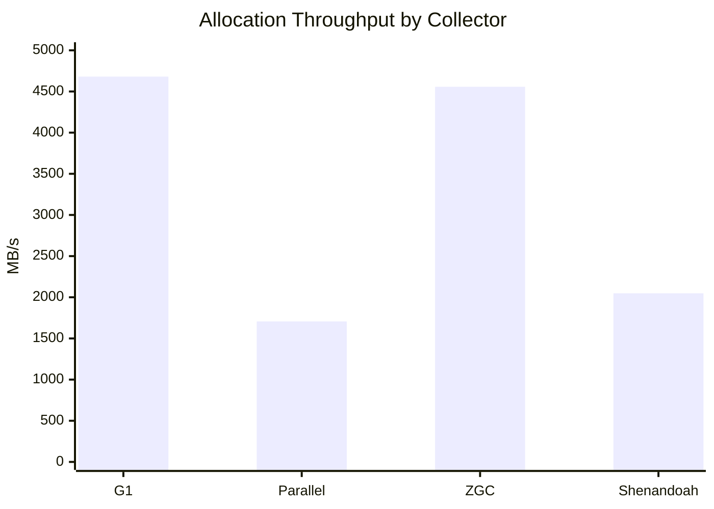
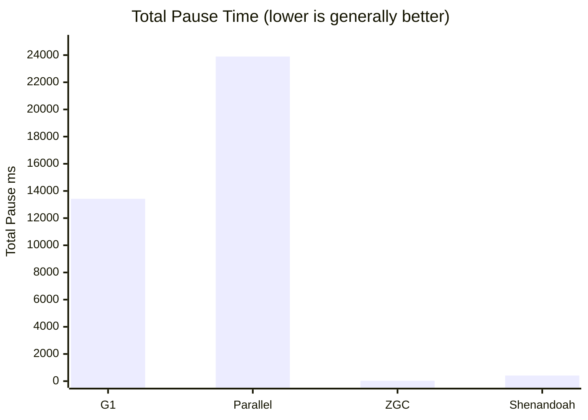
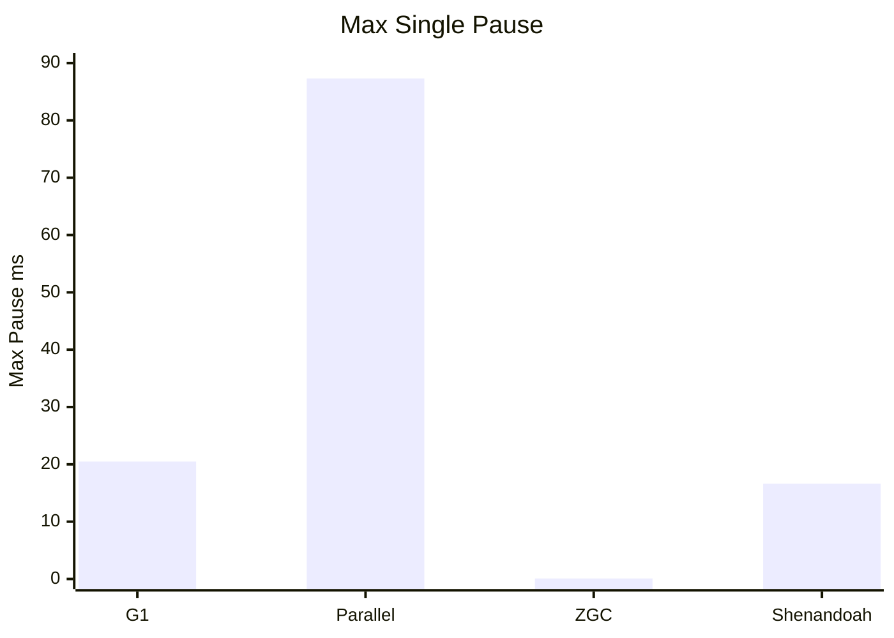
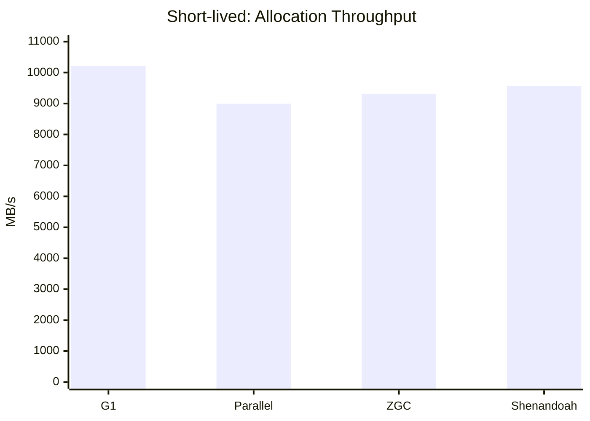
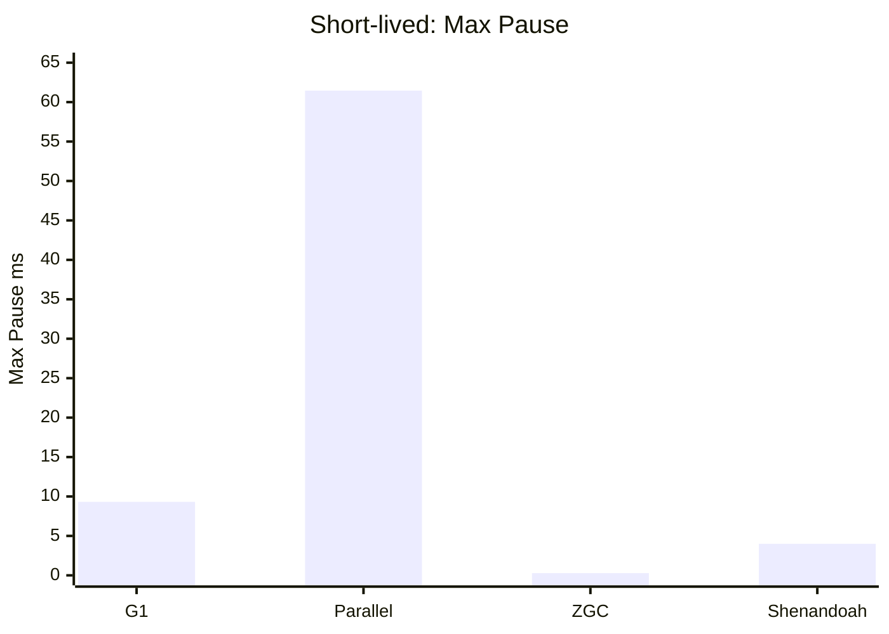
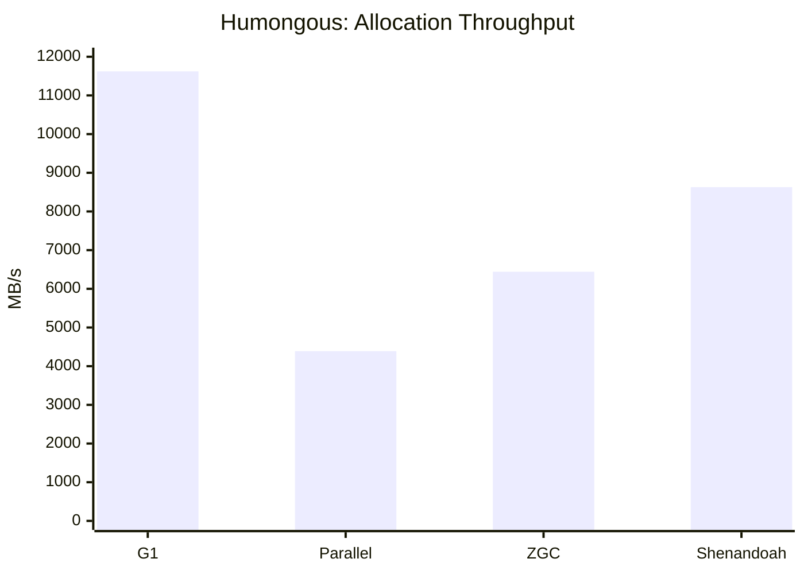
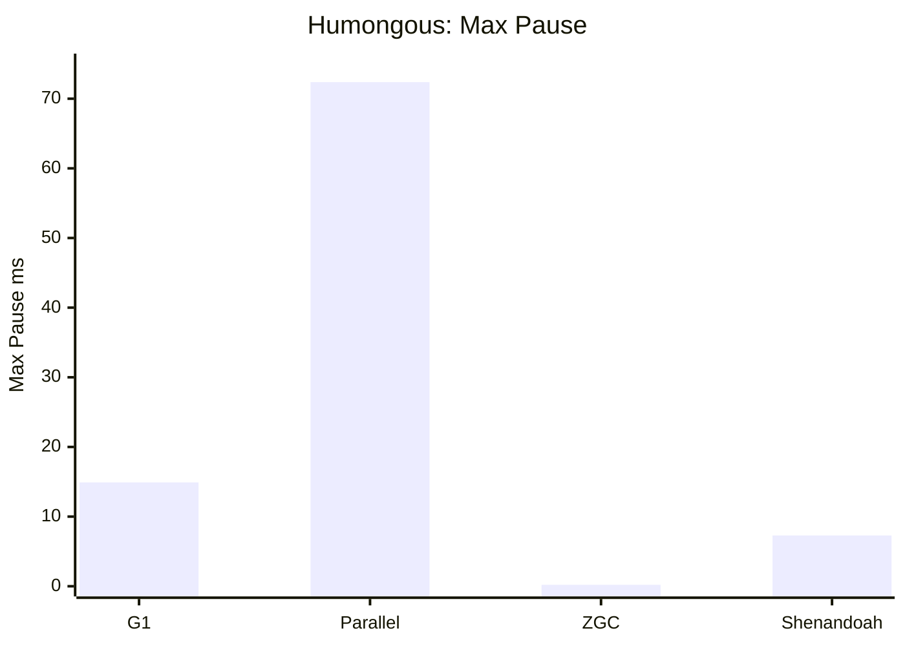

# Garbage Collection Stress Lab

This folder contains a standalone JVM GC stress demo:

- `GarbageCollectionStressLab.java`

It continuously allocates memory in patterns that let you observe:

- Young generation GC behavior (short-lived objects)
- Survivor promotion into old generation (mixed workload)
- Large-object pressure (humongous scenario)

## Build

From `abc-trading/examples/java`:

```bash
mvn -q -DskipTests compile
```

## Run (default = mixed)

```bash
java -cp target/classes com.abc.trading.garbageCollection.GarbageCollectionStressLab
```

## Run with different scenarios

```bash
# Mostly short-lived allocations (frequent minor GCs)
java -Xms1g -Xmx1g -cp target/classes \
  com.abc.trading.garbageCollection.GarbageCollectionStressLab \
  --scenario short-lived --durationSec 60 --burst 4000 --pauseMs 2

# Mixed: some survivors get promoted into old gen
java -Xms1g -Xmx1g -cp target/classes \
  com.abc.trading.garbageCollection.GarbageCollectionStressLab \
  --scenario mixed --durationSec 60 --survivorRate 12

# Humongous: periodic large allocations
java -Xms2g -Xmx2g -cp target/classes \
  com.abc.trading.garbageCollection.GarbageCollectionStressLab \
  --scenario humongous --durationSec 60 --maxLiveMb 1024
```

## Try different collectors

```bash
# G1GC (default on many JDKs)
java -XX:+UseG1GC -Xms1g -Xmx1g -Xlog:gc*,safepoint:file=gc-g1.log:time,uptime,level,tags \
  -cp target/classes com.abc.trading.garbageCollection.GarbageCollectionStressLab --scenario mixed

# Parallel GC
java -XX:+UseParallelGC -Xms1g -Xmx1g -Xlog:gc*,safepoint:file=gc-parallel.log:time,uptime,level,tags \
  -cp target/classes com.abc.trading.garbageCollection.GarbageCollectionStressLab --scenario mixed

# ZGC (JDK 21+)
java -XX:+UseZGC -Xms1g -Xmx1g -Xlog:gc*,safepoint:file=gc-zgc.log:time,uptime,level,tags \
  -cp target/classes com.abc.trading.garbageCollection.GarbageCollectionStressLab --scenario mixed

# Shenandoah (if your JDK build includes it)
java -XX:+UseShenandoahGC -Xms1g -Xmx1g -Xlog:gc*,safepoint:file=gc-shenandoah.log:time,uptime,level,tags \
  -cp target/classes com.abc.trading.garbageCollection.GarbageCollectionStressLab --scenario mixed
```

## Visualize memory layout and GC activity

1. Use GC logs (`-Xlog:gc*,safepoint`) to see pause types, cycle phases, and heap transitions.
2. In another terminal while app runs, inspect heap summary:

```bash
jcmd <PID> GC.heap_info
jcmd <PID> GC.class_histogram
```

3. Capture a Java Flight Recorder profile and open in JDK Mission Control:

```bash
java -XX:StartFlightRecording=filename=gc.jfr,duration=60s,settings=profile \
  -XX:+UseG1GC -Xms1g -Xmx1g -cp target/classes \
  com.abc.trading.garbageCollection.GarbageCollectionStressLab --scenario mixed
```

In JMC, inspect GC pauses, allocation rate, and heap usage over time to understand collector behavior.

## Measured comparison (2026-08-07)

Workload used for all runs:

```bash
java <GC_OPTION> -Xms1g -Xmx1g \
  -Xlog:gc*,safepoint:file=gc-results/gc-<GC>.log:time,uptime,level,tags \
  -cp target/classes com.abc.trading.garbageCollection.GarbageCollectionStressLab \
  --scenario mixed --durationSec 30 --burst 2500 --pauseMs 5 --survivorRate 12 --maxLiveMb 768
```

Generated artifacts are under `examples/java/gc-results`:

- `out-<GC>.txt`: app output
- `gc-<GC>.log`: GC + safepoint logs
- `summary.csv`: parsed metrics
- `summary-short-lived.csv`: parsed metrics for short-lived scenario
- `summary-humongous.csv`: parsed metrics for humongous scenario

### Raw metrics

| GC | Total allocated (MB) | Allocation rate (MB/s) | Pause events | Total pause (ms) | Max pause (ms) | Concurrent events |
|---|---:|---:|---:|---:|---:|---:|
| G1 | 140,417.4 | 4,680.6 | 9,736 | 13,424.275 | 20.482 | 24,097 |
| Parallel | 51,197.9 | 1,706.6 | 375 | 23,893.289 | 87.312 | 0 |
| ZGC | 136,700.8 | 4,556.7 | 3,450 | 28.454 | 0.094 | 6,933 |
| Shenandoah | 61,436.2 | 2,047.9 | 1,196 | 415.597 | 16.629 | 11,564 |

### Allocation throughput (MB/s)



### Total observed pause time (ms)



### Max observed pause (ms)



### Interpretation (mixed scenario)

- ZGC and G1 delivered the highest allocation throughput in this workload.
- Parallel GC showed the largest stop-the-world pause totals and highest max pause.
- ZGC showed very low pause times with many concurrent phase events.
- Shenandoah reduced pause times versus Parallel but allocated less throughput than G1/ZGC in this run.

These numbers are workload and machine specific; rerun with the same command shape when changing heap size, CPU limits, or scenario.

## Scenario expansion: where each collector tends to be strong or weak

To make strengths/weaknesses clearer, two additional workload shapes were measured across the same four collectors.

### Short-lived scenario (young-gen heavy)

Command shape:

```bash
java <GC_OPTION> -Xms1g -Xmx1g \
  -Xlog:gc*,safepoint:file=gc-results/gc-short-lived-<GC>.log:time,uptime,level,tags \
  -cp target/classes com.abc.trading.garbageCollection.GarbageCollectionStressLab \
  --scenario short-lived --durationSec 30 --burst 4000 --pauseMs 2 --survivorRate 2 --maxLiveMb 512
```

| GC | Allocation rate (MB/s) | Total pause (ms) | Max pause (ms) |
|---|---:|---:|---:|
| G1 | 10,220.1 | 3,723.692 | 9.317 |
| Parallel | 8,992.3 | 3,203.721 | 61.458 |
| ZGC | 9,313.9 | 17.280 | 0.289 |
| Shenandoah | 9,568.4 | 333.411 | 4.000 |





### Humongous scenario (large-object pressure)

Initial aggressive settings caused OOM for all collectors at `-Xmx1g`; the tuned comparison below keeps pressure high while allowing all collectors to complete.

Command shape (tuned):

```bash
java <GC_OPTION> -Xms1g -Xmx1g \
  -Xlog:gc*,safepoint:file=gc-results/gc-humongous-<GC>.log:time,uptime,level,tags \
  -cp target/classes com.abc.trading.garbageCollection.GarbageCollectionStressLab \
  --scenario humongous --durationSec 30 --burst 700 --pauseMs 8 --survivorRate 3 --maxLiveMb 512
```

| GC | Allocation rate (MB/s) | Total pause (ms) | Max pause (ms) |
|---|---:|---:|---:|
| G1 | 11,623.0 | 5,698.014 | 14.907 |
| Parallel | 4,388.8 | 21,339.264 | 72.375 |
| ZGC | 6,441.6 | 17.918 | 0.206 |
| Shenandoah | 8,629.7 | 547.060 | 7.296 |





## Strengths and weaknesses matrix (based on these runs)

| Collector | Stronger when | Weaker when | Evidence from this lab |
|---|---|---|---|
| G1 | You need high throughput with balanced latency on mixed/large-object pressure | You need ultra-low pause guarantees | Highest MB/s in short-lived and humongous; pauses much higher than ZGC/Shenandoah |
| Parallel | Throughput-centric batch workloads where pause spikes are acceptable | Latency-sensitive workloads | Highest max pauses (61–87 ms range) and largest total pause time |
| ZGC | Low-latency services with tight pause budgets | Raw throughput can trail G1 on some allocation patterns | Lowest max pause (≈0.1–0.3 ms) and very low total pause across all scenarios |
| Shenandoah | Low-pause operation with better throughput than ZGC in some heavy patterns | May still lag G1 on peak throughput for this workload | Low max pauses (4–16 ms), throughput generally between G1 and ZGC/Parallel |

### Practical chooser

- If your priority is **lowest latency/pause**, start with `ZGC`.
- If your priority is **balanced default** and strong throughput, start with `G1`.
- If your priority is **simple throughput batch processing** and pauses are acceptable, consider `Parallel`.
- If you want **low pause with potentially better throughput than ZGC** on your workload, evaluate `Shenandoah`.
