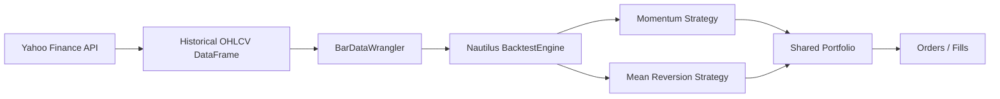

# Nautilus multi-instrument stock backtest report

## Overview

This report captures a small Nautilus backtest that uses historical daily OHLCV data from Yahoo Finance for AAPL and NVDA.
It demonstrates a single portfolio with multiple instruments and two simple example strategies:
- a momentum strategy for AAPL
- a mean reversion strategy for NVDA

## Data flow

## Instruments and data

- AAPL: 250 bars from 1672704000000000000 to 1703808000000000000
- NVDA: 250 bars from 1672704000000000000 to 1703808000000000000

## Strategy outcomes

- Momentum (AAPL): 24 signals, 24 orders, latest position 0
- Mean Reversion (NVDA): 52 signals, 52 orders, latest position 0

## Sample trace entries

| strategy | timestamp | signal | close | position |
| --- | --- | --- | ---: | ---: |
| momentum | 1673481600000000000 | buy | 133.41 | 0 |
| momentum | 1673568000000000000 | flat | 134.76 | 10 |
| momentum | 1673913600000000000 | flat | 135.94 | 10 |
| mean_reversion | 1673222400000000000 | flat | 15.63 | 0 |
| mean_reversion | 1673308800000000000 | flat | 15.91 | 0 |
| mean_reversion | 1673395200000000000 | flat | 16.00 | 0 |
