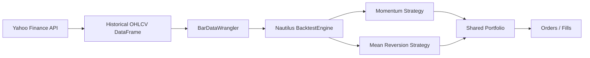

# Nautilus multi-instrument stock backtest report

## Overview

This report captures a small Nautilus backtest that uses historical daily OHLCV data from Yahoo Finance for AAPL and NVDA.
It demonstrates a single portfolio with multiple instruments and two simple example strategies:
- a momentum strategy for AAPL
- a mean reversion strategy for NVDA

## Data flow

## Instruments and data

- AAPL: 250 bars from 2023-01-03 00:00:00+00:00 to 2023-12-29 00:00:00+00:00
- NVDA: 250 bars from 2023-01-03 00:00:00+00:00 to 2023-12-29 00:00:00+00:00

## Strategy outcomes

- Momentum (AAPL): 24 signals, 24 orders, latest position 0
- Mean Reversion (NVDA): 52 signals, 52 orders, latest position 0

## Sample trace entries

| strategy | timestamp | signal | close | position |
| --- | --- | --- | ---: | ---: |
| momentum | 1672704000000000000 | flat | 125.07 | 0 |
| momentum | 1672790400000000000 | flat | 126.36 | 0 |
| momentum | 1672876800000000000 | flat | 125.02 | 0 |
| mean_reversion | 1672704000000000000 | flat | 14.31 | 0 |
| mean_reversion | 1672790400000000000 | flat | 14.75 | 0 |
| mean_reversion | 1672876800000000000 | flat | 14.27 | 0 |
